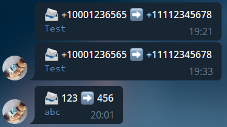

# sms-gate



## Quick start

### env

```
# Twilio
# https://www.twilio.com/console
ACCOUNT_SID=
AUTH_TOKEN=

# Telegram
BOT_TOKEN=
CHAT_ID=
```

### Docker

- Fill `.env`

```bash
docker-compose up
```

## API

| Path       | Method | Body                                                                | Description           |
|------------|--------|---------------------------------------------------------------------|-----------------------|
| `/sms`     | `POST` | `application/x-www-form-urlencoded` `From=+1...&To=+1...&Body=test` | SMS Webhook           |
| `/numbers` | `GET`  |                                                                     | Get available numbers |
